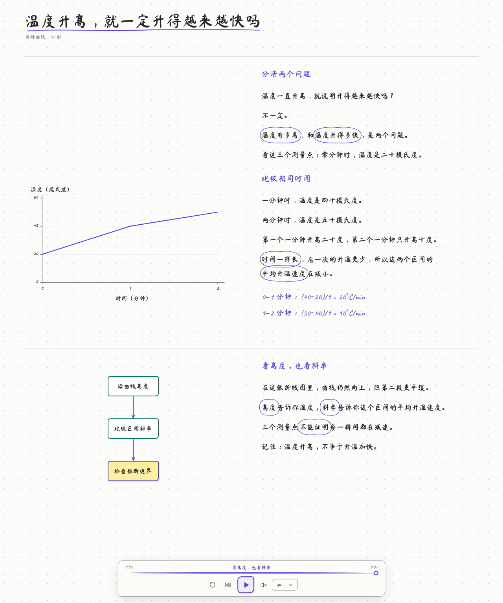

# learnAnything — CLI Demo

输入一个主题，在本地生成一堂包含语音、动态板书和概念动画的课程。

[下载 v0.1.0-demo.1](https://github.com/AmakitaCastle/learn-anything/releases/tag/v0.1.0-demo.1) · [GitHub 仓库](https://github.com/AmakitaCastle/learn-anything)

```text
LLM → LessonDraft 0.1.0 → compileLessonDraft()
    → MP3 + LessonSpec 0.1.0 + VTT → lesson-player
```



第一版通过终端使用，课程在本机浏览器播放。当前为实验性 Demo，课程内容与语音需要人工复核；协议版本为 0.1.0，尚未发布 npm 包。

## 先体验一堂课

安装 Node.js ≥22.13，下载源码并进入项目目录：

```bash
npm ci
npm run demo
```

浏览器打开后点击“播放”。自带升温曲线课展示完整旁白板书、图文跟随和局部圈重点；支持暂停、拖动进度、倍速、静音和重播。**体验自带课程无需 API Key、FFmpeg 或语音缓存**，安装依赖后可离线播放。

不自动打开浏览器时：

```bash
npm run demo -- --no-open
```

打开终端显示的地址。按 Ctrl+C 关闭本地服务。

## 生成自己的课程

生成课程还需要 FFmpeg／FFprobe，以及文本模型和豆包语音服务的独立配置。

```bash
# macOS（已安装 Homebrew）
brew install ffmpeg

# Ubuntu / Debian
sudo apt-get update
sudo apt-get install ffmpeg

# 已有 .env.local 时保留原文件；首次复制配置模板
cp -n .env.example .env.local
```

在 `.env.local` 中填写：

| 配置                                                                  | 用途                                             |
| --------------------------------------------------------------------- | ------------------------------------------------ |
| `LESSON_LLM_PROVIDER / LESSON_LLM_MODEL / LESSON_LLM_API_KEY`         | 文本模型生成课程材料                             |
| `LESSON_LLM_BASE_URL`                                                 | 可选兼容接口根地址，包含版本路径，不包含动作路径 |
| `DOUBAO_SPEECH_API_KEY / DOUBAO_TTS_RESOURCE_ID / DOUBAO_TTS_SPEAKER` | 语音合成，需要与账号权限和音色版本匹配           |
| `DOUBAO_TTS_SPEECH_RATE`                                              | 合成语速，默认 0                                 |

配置好后：

```bash
npm run lesson -- "二分查找为什么能排除一半" --generate
```

命令生成材料、编译语音／课程／字幕／手写资源、保存课程并打开本地播放器。`--generate` 允许文本模型和缺失语音缓存的接口请求，可能消耗额度。不带它只做输入预检。

支持 OpenAI 兼容、Anthropic、Gemini 三种协议及自定义适配器；协议支持不代表所有厂商和模型已实测。配置详情见[文本模型](./docs/lesson-draft-generator.md)和[豆包语音](./docs/tts-doubao.md)。

## 保存、重播和失败恢复

产物保存到 `outputs/runs/<id>/<run>/`：

```text
lesson.draft.json   模型输出的结构化材料
generation.json    材料来源与生成记录
narration.mp3      连续旁白
lesson.json        LessonSpec 0.1.0
captions.vtt       字幕
alignment.json    实测时间、锚点与低置信度词
handwriting.ttf   手写字体
```

```bash
# 重播已保存课程，不请求模型或语音服务
npm run lesson -- --play outputs/runs/<id>/<run>

# 语音编译失败后，从已保存材料继续，复用已有片段缓存
npm run lesson -- --draft <目录>/lesson.draft.json --generate

# 已有材料，只复用本机缓存；缓存缺失就停止
npm run lesson -- --draft <文件> --cached

# 只生成并保存，不启动播放器
npm run lesson -- "水循环" --generate --no-play

npm run lesson -- --help
```

完整参数、错误处理和恢复说明见[终端使用指南](./docs/terminal-lesson.md)。

## 第一版范围与实现

LLM 生成受约束的材料与语义锚点，编译器根据真实语音词时间戳确定事件时间；播放器只消费编译产物。内置数组查找、流程、状态转换和曲线四种动画语法；宿主另注册通用二维情境动画 `scene`，用人物、物件、气泡和区域呈现情境与概念变化。课程不执行模型生成的 HTML、JavaScript 或组件。

新材料使用全文板书，保留讲解过程，关联图示并跟随当前讲解滚动。手写路径由字体轮廓生成，不保证规范汉字笔顺；缺字符局部回退。知识正确性、声音自然度和低置信度词需人工检查。

本版聚焦主题生成、本地编译与本地播放；文件解析／RAG、账户、在线服务、学习画像和互动追问列入后续路线图。macOS 已做本地验证，Linux 由 CI 复核；Windows 尚未做实机验收。

| 模块                              | 职责                                   |
| --------------------------------- | -------------------------------------- |
| `packages/lesson-draft-generator` | 模型适配、人工导入、材料校验           |
| `packages/content-generator`      | TTS、MP3、真实时间对齐与课程编译       |
| `packages/lesson-player`          | 音频时钟、板书、动画和播放控制         |
| `packages/lesson-schema`          | LessonDraft／LessonSpec 0.1.0 公共协议 |
| `scripts/`、`viewer/`             | 终端编排与独立本地播放宿主             |

模块互不依赖，只共享协议。原网页开发入口 `npm run dev` 保留水循环及二分查找等回归示例。

## 开发与贡献

```bash
npm test
npm run typecheck
npm run lint
npm run build
npm run test:modules
npx playwright install chromium
npm run test:browser
```

已有开发服务时，可用 `VINEXT_NO_DEV_LOCK=1 npm run test:browser` 启动独立测试服务。模型测试使用传输夹具，音频测试包含实际编码的静音 MP3，不消耗接口额度。浏览器像素比较范围固定为 Chromium 1280×720、DPR 1；其他平台像素一致性不作承诺。

- [架构](./docs/module-architecture.md) · [课程材料与编译](./docs/lesson-draft.md)
- [播放器接口](./docs/classroom-capability.md) · [动画扩展](./docs/visual-grammars.md)
- [能力包扩展规范](./docs/capability-packs.md) · [文科情境动画样例](./examples/task-separation/README.md)
- [全文板书](./docs/full-board.md) · [手写资源](./docs/handwriting-resources.md)
- [Git 与 CLI 自动发布](./docs/ci-cd.md)
- [首版发布与验收](./docs/demo-release.md) · [路线图](./ROADMAP.md)
- [贡献指南](./CONTRIBUTING.md) · [安全说明](./SECURITY.md)

项目原创代码采用 [Apache-2.0](./LICENSE)。第三方字体和 Tegaki 资源保留各自许可证，见 [NOTICE](./NOTICE)。
